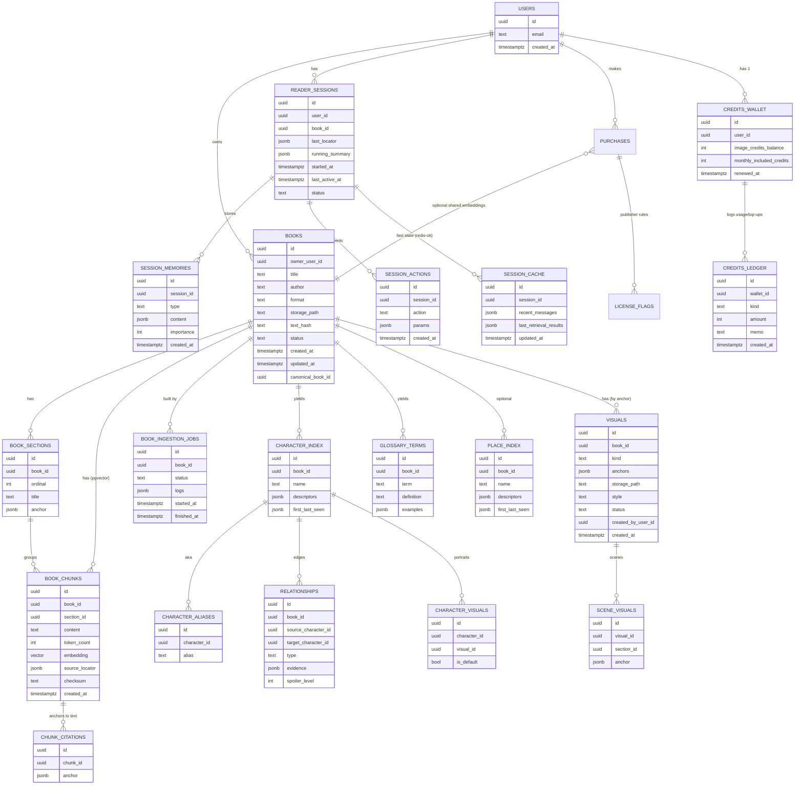

```mermaid
erDiagram
    USERS ||--o{ BOOKS : "owns"
    USERS ||--o{ READER_SESSIONS : "has"
    USERS ||--o{ PURCHASES : "makes"
    USERS ||--o{ CREDITS_WALLET : "has 1"
    CREDITS_WALLET ||--o{ CREDITS_LEDGER : "logs usage/top-ups"

    BOOKS ||--o{ BOOK_SECTIONS : "has"
    BOOKS ||--o{ BOOK_CHUNKS : "has (pgvector)"
    BOOKS ||--o{ BOOK_INGESTION_JOBS : "built by"
    BOOKS ||--o{ CHARACTER_INDEX : "yields"
    BOOKS ||--o{ GLOSSARY_TERMS : "yields"
    BOOKS ||--o{ PLACE_INDEX : "optional"
    BOOKS ||--o{ VISUALS : "has (by anchor)"

    BOOK_SECTIONS ||--o{ BOOK_CHUNKS : "groups"
    BOOK_CHUNKS ||--o{ CHUNK_CITATIONS : "anchors to text"

    CHARACTER_INDEX ||--o{ CHARACTER_ALIASES : "aka"
    CHARACTER_INDEX ||--o{ RELATIONSHIPS : "edges"
    CHARACTER_INDEX ||--o{ CHARACTER_VISUALS : "portraits"
    VISUALS ||--o{ SCENE_VISUALS : "scenes"

    READER_SESSIONS ||--o{ SESSION_MEMORIES : "stores"
    READER_SESSIONS ||--o{ SESSION_ACTIONS : "events"
    READER_SESSIONS ||--o{ SESSION_CACHE : "fast state (redis-ok)"

    PURCHASES }o--|| BOOKS : "optional shared embeddings"
    PURCHASES ||--o{ LICENSE_FLAGS : "publisher rules"

    USERS {
      uuid id
      text email
      timestamptz created_at
    }

    BOOKS {
      uuid id
      uuid owner_user_id
      text title
      text author
      text format
      text storage_path
      text text_hash
      text status
      timestamptz created_at
      timestamptz updated_at
      uuid canonical_book_id
    }

    BOOK_INGESTION_JOBS {
      uuid id
      uuid book_id
      text status
      jsonb logs
      timestamptz started_at
      timestamptz finished_at
    }

    BOOK_SECTIONS {
      uuid id
      uuid book_id
      int ordinal
      text title
      jsonb anchor
    }

    BOOK_CHUNKS {
      uuid id
      uuid book_id
      uuid section_id
      text content
      int token_count
      vector embedding
      jsonb source_locator
      text checksum
      timestamptz created_at
    }

    CHUNK_CITATIONS {
      uuid id
      uuid chunk_id
      jsonb anchor
    }

    CHARACTER_INDEX {
      uuid id
      uuid book_id
      text name
      jsonb descriptors
      jsonb first_last_seen
    }

    CHARACTER_ALIASES {
      uuid id
      uuid character_id
      text alias
    }

    RELATIONSHIPS {
      uuid id
      uuid book_id
      uuid source_character_id
      uuid target_character_id
      text type
      jsonb evidence
      int spoiler_level
    }

    GLOSSARY_TERMS {
      uuid id
      uuid book_id
      text term
      text definition
      jsonb examples
    }

    VISUALS {
      uuid id
      uuid book_id
      text kind
      jsonb anchors
      text storage_path
      text style
      text status
      uuid created_by_user_id
      timestamptz created_at
    }

    CHARACTER_VISUALS {
      uuid id
      uuid character_id
      uuid visual_id
      bool is_default
    }

    SCENE_VISUALS {
      uuid id
      uuid visual_id
      uuid section_id
      jsonb anchor
    }

    READER_SESSIONS {
      uuid id
      uuid user_id
      uuid book_id
      jsonb last_locator
      jsonb running_summary
      timestamptz started_at
      timestamptz last_active_at
      text status
    }

    SESSION_MEMORIES {
      uuid id
      uuid session_id
      text type
      jsonb content
      int importance
      timestamptz created_at
    }

    SESSION_ACTIONS {
      uuid id
      uuid session_id
      text action
      jsonb params
      timestamptz created_at
    }

    SESSION_CACHE {
      uuid id
      uuid session_id
      jsonb recent_messages
      jsonb last_retrieval_results
      timestamptz updated_at
    }

    CREDITS_WALLET {
      uuid id
      uuid user_id
      int image_credits_balance
      int monthly_included_credits
      timestamptz renewed_at
    }

    CREDITS_LEDGER {
      uuid id
      uuid wallet_id
      text kind
      int amount
      text memo
      timestamptz created_at
    }


    PLACE_INDEX {
      uuid id
      uuid book_id
      text name
      jsonb descriptors
      jsonb first_last_seen
    }
```