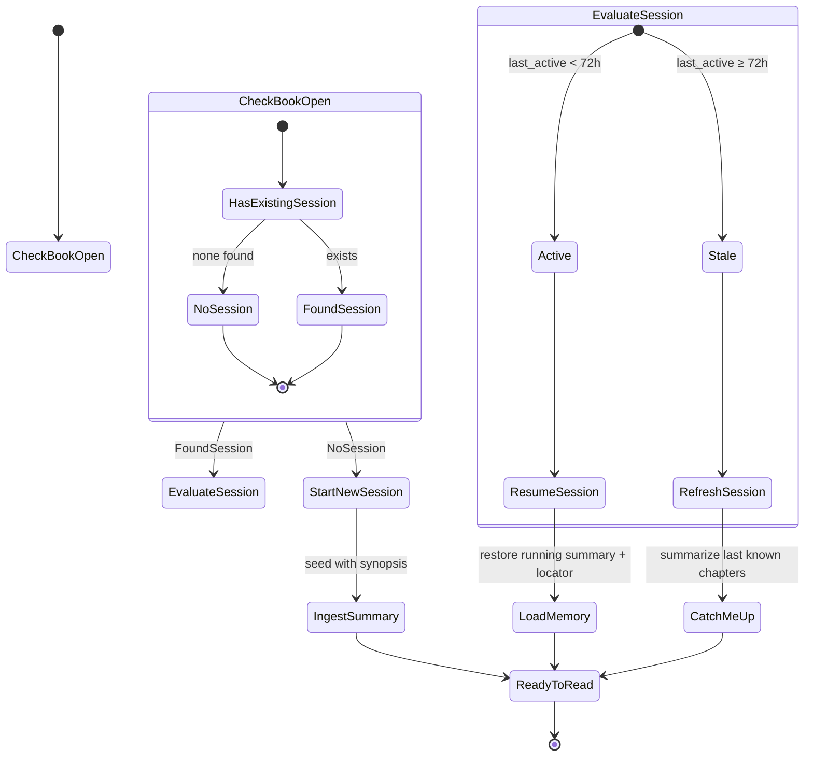

```mermaid
stateDiagram-v2
    [*] --> CheckBookOpen

    state "CheckBookOpen" as CBO {
        [*] --> HasExistingSession
        HasExistingSession --> NoSession : none found
        HasExistingSession --> FoundSession : exists
        NoSession --> [*]
        FoundSession --> [*]
    }

    CBO --> EvaluateSession : FoundSession
    CBO --> StartNewSession : NoSession

    state "EvaluateSession" as ES {
        [*] --> Active : last_active < 72h
        [*] --> Stale : last_active ≥ 72h
        Active --> ResumeSession
        Stale --> RefreshSession
    }

    StartNewSession --> IngestSummary : seed with synopsis
    IngestSummary --> ReadyToRead

    ResumeSession --> LoadMemory : restore running summary + locator
    LoadMemory --> ReadyToRead

    RefreshSession --> CatchMeUp : summarize last known chapters
    CatchMeUp --> ReadyToRead

    ReadyToRead --> [*]
```
