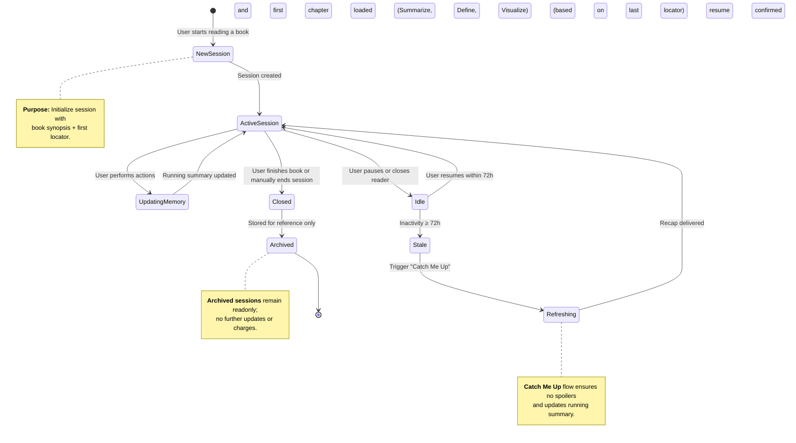

# 🔁 Session Lifecycle Diagram

This Mermaid diagram illustrates how a **reader session** evolves across its lifecycle — from creation, through active reading, to stale and refresh states.  
It ties together user activity, memory updates, and spoiler-safe recap handling.

### 🧭 Notes
- **Session lifespan:** typically active for 72 hours before marked stale.
- **Running summary:** compact state retained across all transitions except archive.
- **Spoiler ceiling:** enforced during all transitions; never retrieves beyond the user's last progress.
- **Archived sessions:** can be revisited for stats or personal analytics but not continued.

---

✨ *“Every reading session tells a story — and now, your AI remembers it too.”*
